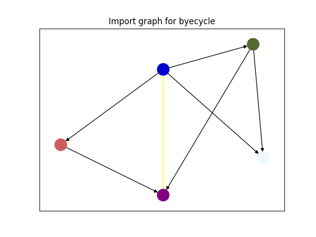
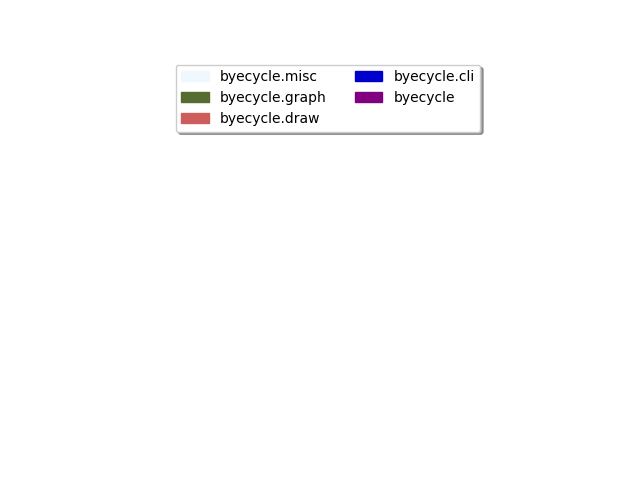

# byecycle 🚲

Find and expose cyclic imports in python projects.

## Installation

### From pyPI

 - python 3.11 or higher
```shell
# `pipx` might be a better choice, given that it's a global dev-tool
pip install byecycle
```
---

### From Source / Dev Setup

 - python 3.11 or higher
 - [pdm](https://pdm.fming.dev/)
 - git
```shell
git clone https://github.com/a-recknagel/byecycle.git
cd byecycle
pdm install
```

## Usage

### As a Command Line Tool

```shell
# with a path
byecycle /home/me/dev/byecycle/src/byecycle/
# or an installed package
byecycle byecycle
```
The result will be a well-formed json string:

```json
{
  "byecycle.misc": {},
  "byecycle.graph": {
    "byecycle": {
      "tags": [
        "vanilla",
        "parent"
      ],
      "cycle": "complicated"
    },
    "byecycle.misc": {
      "tags": [
        "vanilla"
      ],
      "cycle": null
    }
  },
  "byecycle.draw": {
    "byecycle": {
      "tags": [
        "parent"
      ],
      "cycle": null
    }
  },
  "byecycle.cli": {
    "byecycle": {
      "tags": [
        "parent"
      ],
      "cycle": null
    },
    "byecycle.misc": {
      "tags": [
        "vanilla"
      ],
      "cycle": null
    },
    "byecycle.graph": {
      "tags": [
        "vanilla"
      ],
      "cycle": null
    },
    "byecycle.draw": {
      "tags": [
        "vanilla"
      ],
      "cycle": null
    }
  },
  "byecycle": {
    "byecycle.graph": {
      "tags": [
        "vanilla",
        "parent"
      ],
      "cycle": "complicated"
    }
  }
}
```
By default, the result is printed with some rich formatting to highlight types and such.
If you need the output to be plain ascii, pass the `--no-rich` flag.

---

For bigger projects, you might get much more complex output. The intent of returning 
`json` is to have something that can be easily piped into e.g. `jquery` for further 
processing:

```shell
# filter out imports that don't have a cycle
byecycle byecycle | jq '.[] |= (.[] |= select(.cycle != null) | select(. != {}))'
```
```json
{
  "byecycle.graph": {
    "byecycle": {
      "tags": [
        "parent",
        "vanilla"
      ],
      "cycle": "complicated"
    }
  },
  "byecycle.cli": {
    "byecycle": {
      "tags": [
        "parent",
        "vanilla"
      ],
      "cycle": "complicated"
    }
  },
  "byecycle": {
    "byecycle.graph": {
      "tags": [
        "parent",
        "vanilla"
      ],
      "cycle": "complicated"
    },
    "byecycle.cli": {
      "tags": [
        "parent",
        "vanilla"
      ],
      "cycle": "complicated"
    }
  }
}
```
Alternatively, you can also call the main entrypoint's core functionality as a regular
python function which will return the result as a dictionary:

```python
from byecycle import run
cycles, *_ = run("byecycle")
# filter out imports that don't have a cycle
for outer_k, outer_v in cycles.items():
    for inner_k, inner_v in outer_v.items():
        if inner_v["cycle"]:
            print(f"{outer_k} -> {inner_k}: {inner_v['cycle']}")
```
```text
byecycle.graph -> byecycle -> complicated
byecycle.cli -> byecycle -> complicated
byecycle -> byecycle.graph -> complicated
byecycle -> byecycle.cli -> complicated
```

### To Visualize the Import Graph

If you pass the `--draw` flag on your command-line-call, byecycle will create an image of
the import graph instead:

```shell
byecycle byecycle --draw
```


